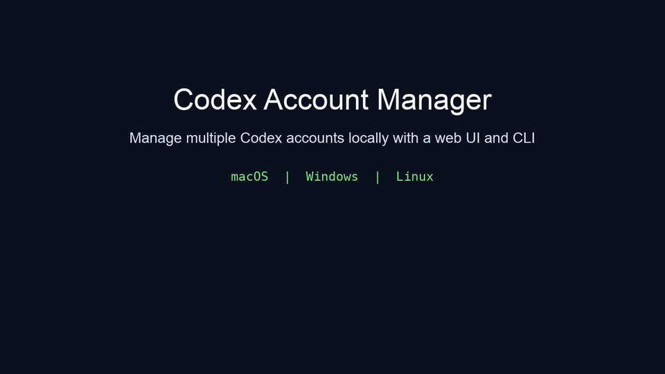
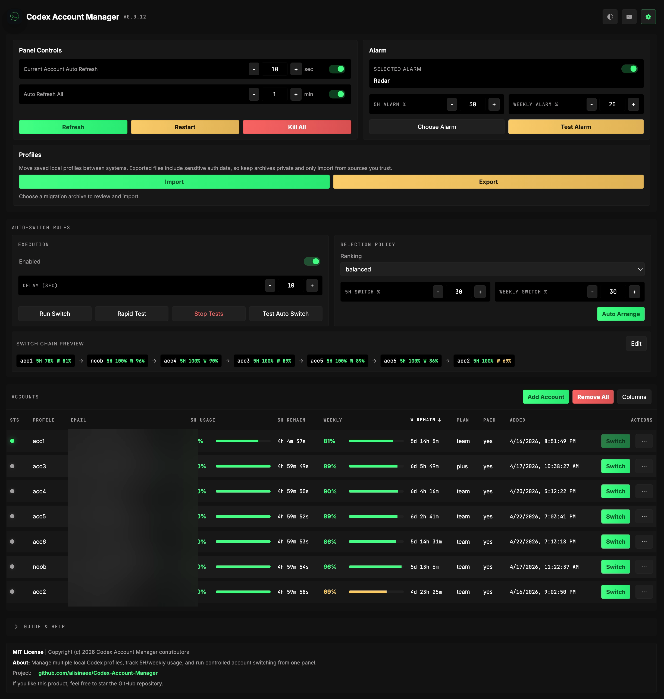

<p align="center">
  
</p>

# Codex Account Manager

Cross-platform Codex account manager with a local web UI, profile switching, usage tracking, native OS notifications, auto-switching, and migration tools.

[](https://github.com/alisinaee/Codex-Account-Manager/releases)
[](https://github.com/alisinaee/Codex-Account-Manager/blob/main/pyproject.toml)
[](LICENSE)
[](README.md#faq)
[](https://github.com/alisinaee/Codex-Account-Manager/actions/workflows/windows-ci.yml)

Manage multiple Codex accounts locally instead of hand-editing auth files. Save named profiles, switch faster, watch usage, tune native notifications, run auto-switch logic, and keep everything in a local-first workflow on macOS, Windows, and Linux.





The web panel keeps profile switching, usage monitoring, import/export, native notifications, and update controls in one local browser UI without requiring Electron, Tauri, Node, or Rust.

## 3-Minute Quick Start

Install:

```bash
pipx install "git+https://github.com/alisinaee/Codex-Account-Manager.git@main"
```

Save your current Codex auth as a named profile:

```bash
codex-account save work
```

Open the local web UI:

```bash
codex-account ui
```

If the browser does not open automatically, open `http://127.0.0.1:4673`.

Helpful links:

- [GitHub Releases](https://github.com/alisinaee/Codex-Account-Manager/releases)
- [CLI Reference](docs/cli-reference.md)
- [UI API](docs/ui-api.md)
- [Troubleshooting](docs/troubleshooting.md)

## Why Use Codex Account Manager?

- Manage multiple Codex accounts locally with named profiles instead of raw auth-file juggling.
- Switch faster than manual auth handling and keep the current active account visible in both CLI and web UI.
- Watch quota usage and auto-switch before `5H` or weekly limits block your workflow.
- Keep the workflow local-first and cross-platform with the same install and UI model on macOS, Windows, and Linux.

## Who This Is For

- Solo developers who move between multiple Codex accounts during the day.
- Heavy Codex users who want usage warnings, native OS notifications, and auto-switch assistance.
- Users who want a polished local UI instead of memorizing raw command sequences.

## Manual Workflow vs Codex Account Manager

| Workflow | Manual Codex account handling | Codex Account Manager |
| --- | --- | --- |
| Save current auth | Copy files manually and label them yourself | `codex-account save <name>` |
| Switch accounts | Replace auth files and restart apps manually | CLI switch or local web panel actions |
| Monitor usage | Query usage ad hoc per account | Track `5H` and weekly usage per profile |
| Stay ahead of limits | Manual checking and guesswork | Warnings, native notifications, and auto-switch rules |
| Move profiles between machines | Manual file copying | Private `.camzip` import/export flow |

## Privacy / Security

Codex Account Manager is built for local-first account management:

- No live API server or hosted backend is used by this project for storing your accounts.
- The web UI runs locally on your machine (default bind: `127.0.0.1`).
- Profile/auth snapshots, settings, and migration archives remain on your system unless you explicitly export/share them.

This project may call upstream services that Codex itself uses for account and usage operations, but Codex Account Manager does not add its own cloud account-storage service. See [SECURITY.md](SECURITY.md) for detailed storage and reporting guidance.

## Codex Profile Switching

- Save the current Codex auth as a named local profile.
- Add accounts through a guided login flow with device-login and normal-login options.
- List, switch, rename, and remove saved profiles from the CLI or web panel.
- Keep the active account visible so you can see what is live before you switch.
- Current support targets the Codex CLI and the Codex VS Code extension.
- On some operating systems and client launch paths, the Codex CLI or VS Code extension may need a manual reload after a switch before the new account becomes active in that client.

## Codex Usage Monitoring

- Track per-profile `5H` and weekly usage locally.
- Refresh the current account on a fast timer and sweep all accounts on a slower background timer.
- Show remaining percentages, reset timers, plan metadata, account IDs, and account health states.
- Sync healthy live auth back into saved profiles only when identity matches, reducing stale-token drift without cross-profile overwrite.

## Codex Account Migration

- Export all saved profiles or selected profiles into private `.camzip` migration archives.
- Review imports before applying them and detect conflicts before overwrite actions happen.
- Move profiles between machines while keeping the process local-first.

## Codex Auto-Switch Automation

- Enable or disable auto-switching rules locally.
- Configure thresholds, delay, ranking mode, and candidate eligibility.
- Preview and manually edit the switch chain.
- Run one-off switch tests, rapid tests, and controlled auto-switch test flows.
- Send native heads-up notifications about 30 seconds before delayed auto-switch execution.

## Release Notes and App Updates

- Review the latest release notes on [GitHub Releases](https://github.com/alisinaee/Codex-Account-Manager/releases).
- Use the detailed in-repo release log in [CHANGELOG.md](CHANGELOG.md) or [docs/release-notes.md](docs/release-notes.md).
- The web panel can detect updates and run the `pipx upgrade codex-account-manager` flow from the UI.

## Web Panel

The web panel is the main day-to-day experience. It runs locally in your browser and gives you a fast control surface without a heavyweight desktop runtime.

Start it with:

```bash
codex-account ui
```

Default local address:

- URL: `http://127.0.0.1:4673`
- Host: `127.0.0.1`
- Port: `4673`

What you can do in the panel:

- Add, switch, rename, and remove accounts
- Refresh the current account separately from all-account background refresh
- Manage profiles from the full-width `Profiles` section with `Import` and `Export`
- Export selected profiles with bulk selection and custom archive naming
- Review migration imports before applying them
- Configure warning thresholds and send native notification test alerts
- Control auto-switch behavior, test it, and edit the switch chain
- Read in-app release notes and trigger app updates when a newer version exists
- Use the debug/system output panel for troubleshooting
- Learn the UI through built-in guide/help content and broad tooltip coverage

## Experimental Electron Desktop Shell

The Electron shell is an optional desktop app for users who want a windowed experience, tray/menu-bar status, and Electron-native notifications. It does not replace the web panel; it starts or connects to the same local Python UI service but renders its own desktop-focused React interface.

Developer run:

```bash
codex-account electron
```

What the dev shell adds:

- Desktop window with a separate Electron UI
- macOS menu-bar or Windows/Linux tray entry
- Current profile usage in the tray tooltip/menu
- Safe desktop switching that does not restart or close the Electron app
- Electron-native test notifications that focus the desktop window when clicked
- Project icon/name in the Electron window, menus, tray, notifications, and packaged app metadata

Current limitation: this is a development shell, not a packaged installer. It requires the source checkout to include the `electron/` directory and `npm` to be available. When launched through the raw Electron development binary, macOS may still show `Electron` for the Dock app bundle even though the app menu/window/tray/notification identity is set to Codex Account Manager. The packaged `.app` metadata under `electron/package.json` is prepared for the real Dock name and icon in a later installer phase. Users should still install and run the main app with `pipx` and `codex-account ui`.

## CLI

The CLI remains a first-class part of the project for scripting, terminal-first workflows, and advanced operations.

Most important commands:

```bash
codex-account --help
codex-account save work
codex-account add work --device-auth
codex-account list --json
codex-account current --json
codex-account switch work
codex-account ui
codex-account electron
codex-account export-profiles -o ./profiles.camzip
codex-account import-profiles ./profiles.camzip
```

Useful command groups:

- Local profile workflows: `save`, `add`, `list`, `current`, `switch`, `rename`, `remove`, `run`
- Usage monitoring: `usage-local`, `usage`
- Web UI and desktop control: `ui`, `electron`, `ui-service`, `ui-autostart`
- Advanced wrappers: `status`, `login`, `list-adv`, `switch-adv`, `import`, `remove-adv`, `config`, `daemon`, `clean`, `auth`

## FAQ

### Does this work on Windows, macOS, and Linux?

Yes. The project is designed for cross-platform local use and documents the same install and web UI workflow across macOS, Windows, and Linux.

### Is this local-only?

Yes. The web panel runs on your machine and binds to `127.0.0.1` by default. Profile management, imports/exports, and local state stay on your system unless you explicitly move an archive elsewhere.

### Does it require Electron, Tauri, Node, or Rust?

No. The UI is a local browser panel served by the Python app. Optional advanced wrapper commands may use `npx` for `@loongphy/codex-auth`, but the project does not depend on Electron, Tauri, Node, or Rust for the main experience.

### How are credentials stored?

Saved profile snapshots are stored locally under your Codex home and related local storage paths used by this tool. See [docs/config-and-storage.md](docs/config-and-storage.md) and [SECURITY.md](SECURITY.md) for details.

### Do I need Codex installed first?

Yes. Codex CLI must already be installed and available as `codex` in your `PATH`.

### Which Codex clients are supported after switching?

The app currently supports the Codex CLI and the Codex VS Code extension. On some OS/client combinations, switching updates the local auth immediately but the active client may still need a manual reload or restart before it starts using the newly switched account.

## Install and Update

Recommended install for macOS, Windows, and Linux:

```bash
pipx install "git+https://github.com/alisinaee/Codex-Account-Manager.git@main"
codex-account --help
```

Requirements:

- Python `3.11+`
- Codex CLI installed and available as `codex` in your `PATH`
- Optional for advanced wrapper commands: `npx` for `@loongphy/codex-auth`

Developer or local-repo run:

```bash
chmod +x bin/codex-account
./bin/codex-account --help
```

Update:

```bash
pipx upgrade codex-account-manager
```

## License

MIT License. See [LICENSE](LICENSE).
