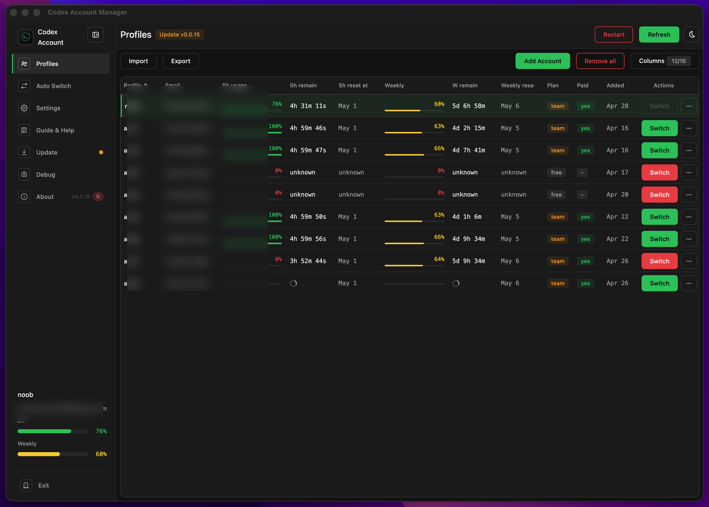
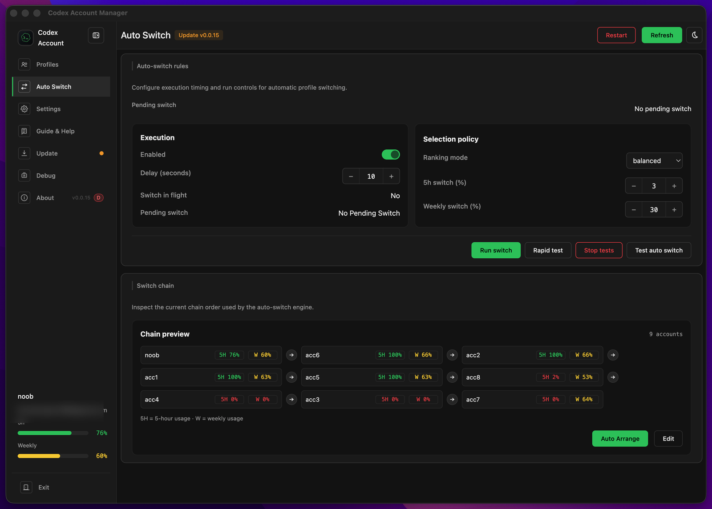
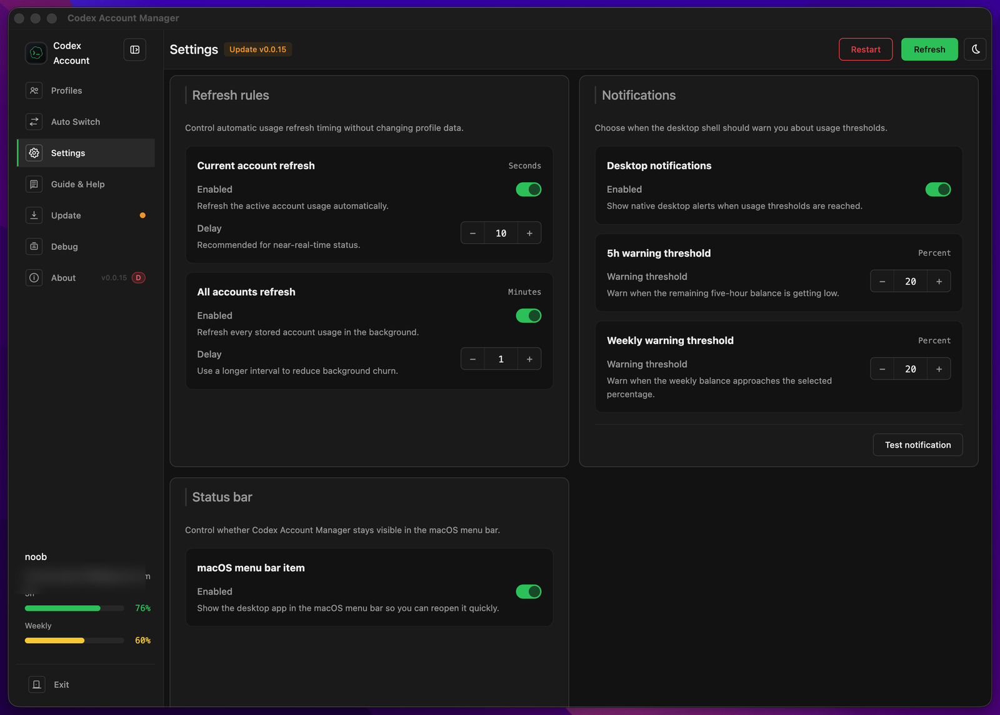
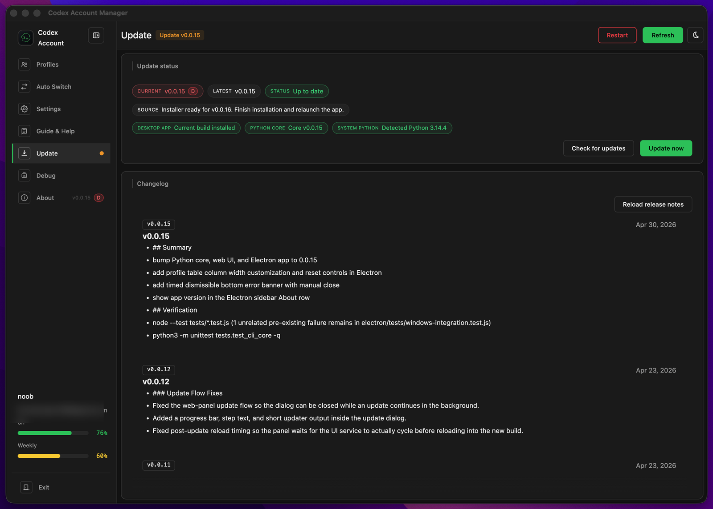
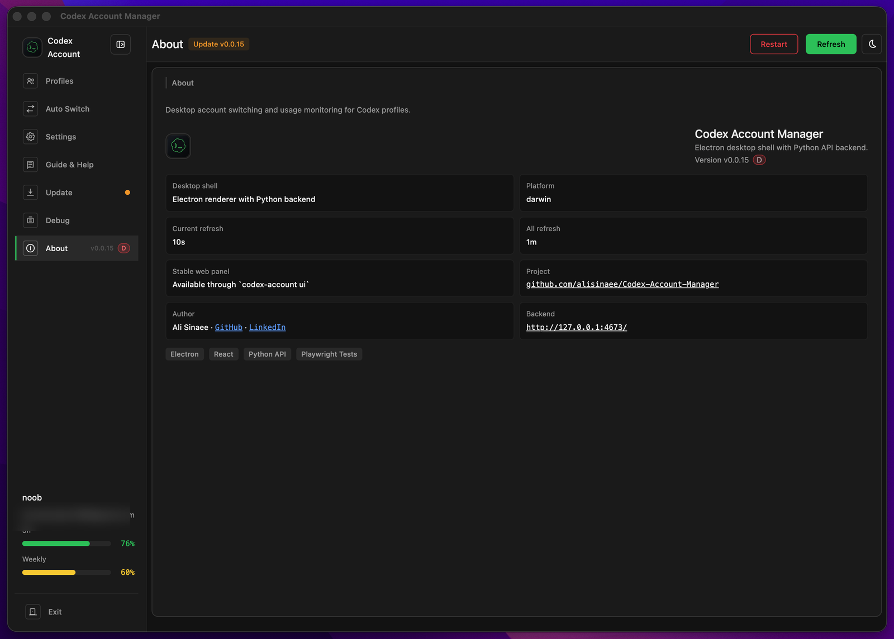

<p align="center">
  
</p>

# Codex Account Manager

Desktop GUI for managing Codex accounts with local-first profile switching, usage tracking, native notifications, tray or menu-bar controls, and packaged app updates on macOS, Windows, and Linux.

Current release: `v0.0.21`

[](https://github.com/alisinaee/Codex-Account-Manager/releases)
[](https://github.com/alisinaee/Codex-Account-Manager/blob/main/pyproject.toml)
[](LICENSE)
[](README.md#install-and-update)
[](https://github.com/alisinaee/Codex-Account-Manager/actions/workflows/windows-ci.yml)

Codex Account Manager keeps account switching, quota monitoring, automation rules, and desktop status signals in one local workflow instead of scattered auth-file edits and manual limit checking. The packaged desktop app connects to the same local Python core used by the CLI and local web panel, so advanced users can still automate or script without giving up the GUI.

Helpful links:

- [GitHub Releases](https://github.com/alisinaee/Codex-Account-Manager/releases)
- [CLI Reference](docs/cli-reference.md)
- [UI API](docs/ui-api.md)
- [Troubleshooting](docs/troubleshooting.md)

## Install and Update

Recommended path: use the packaged desktop app from [GitHub Releases](https://github.com/alisinaee/Codex-Account-Manager/releases).

Use the latest release page for one-click package access:

| Platform | Preferred package | Latest package link |
| --- | --- | --- |
| macOS | `.dmg` | [Open latest macOS package](https://github.com/alisinaee/Codex-Account-Manager/releases/latest) |
| Windows | `.exe` installer | [Open latest Windows package](https://github.com/alisinaee/Codex-Account-Manager/releases/latest) |
| Linux | `.AppImage`, `.deb`, or `.rpm` | [Open latest Linux package](https://github.com/alisinaee/Codex-Account-Manager/releases/latest) |

GitHub always keeps the latest release page stable, so this table stays current even when release tag names change.

Requirements:

- Python `3.11+`
- Codex CLI installed and available as `codex` in your `PATH`

Packaged app behavior:

- The Electron `Update` screen checks current release status.
- The app selects OS-appropriate release assets when they are available.
- Desktop updates may download or open the installer, then finish after relaunch.
- Python core sync is handled separately when the bundled desktop shell needs the latest backend package state.
- The app can guide local setup, but it does not auto-install Python itself.

CLI or developer fallback:

```bash
pipx install "git+https://github.com/alisinaee/Codex-Account-Manager.git"
codex-account --help
```

Update the Python package directly when you are running the CLI path instead of a packaged installer:

```bash
pipx upgrade codex-account-manager
```

## GUI

The desktop app is the primary day-to-day experience for users who want local account control with desktop-native behavior.

### Profiles

Account table, usage visibility, switching, and local import or export workflows.



### Auto Switch

Rules, thresholds, ranking mode, switch chain management, and built-in test controls.



### Settings

Refresh rules, native notifications, and status bar or tray controls.



### Update

Release status, packaged app update flow, and Python core sync details.



### About

Desktop shell and runtime details for the installed app.



## Features

- Desktop GUI for local Codex profile management, switching, rename, remove, and guided account add flows
- Usage tracking for both `5H` and weekly limits with remaining percentages, reset timing, and health state visibility
- Auto-switch automation with thresholds, ranking mode, switch chain controls, delay handling, and one-off or rapid test flows
- Native OS notifications with warning thresholds and click-to-focus desktop behavior
- macOS status bar and Windows or Linux tray integration
- Windows taskbar usage overlay and mini-meter support where enabled
- Local import and export with private `.camzip` archives
- In-app release notes, release status, and desktop update guidance
- Local-first privacy model with no hosted profile storage service

## Why Use Codex Account Manager?

- Manage multiple Codex accounts locally with named profiles instead of raw auth-file juggling.
- Keep the active account and its usage state visible before limits interrupt work.
- Switch faster from a desktop UI while preserving CLI access for automation and terminal-first workflows.
- Stay local-first across macOS, Windows, and Linux without introducing a hosted account backend.

## Privacy / Security

Codex Account Manager is built for local-first account management:

- No live API server or hosted backend is used by this project for storing your accounts.
- The desktop app, local web panel, and Python services run on your machine.
- Profile snapshots, settings, notification preferences, and migration archives remain on your system unless you explicitly export or share them.

This project may call upstream services that Codex itself uses for account and usage operations, but Codex Account Manager does not add its own cloud account-storage service. See [SECURITY.md](SECURITY.md) for detailed storage and reporting guidance.

## How the App Is Structured

Codex Account Manager is one local-first system with three connected layers:

- **Electron desktop app**:
  - packaged GUI for daily use
  - adds tray or menu-bar state, desktop-native notifications, update screens, and platform integrations such as the Windows taskbar overlay
- **Python CLI core (`codex-account`)**:
  - source of truth for profile storage, auth switching, usage collection, auto-switch logic, notifications, import/export, and local `/api/*` endpoints
- **Local web panel (`codex-account ui`)**:
  - browser-based control surface over the same Python backend
  - remains available for users who prefer a local browser UI or need a lightweight fallback

Because all layers share the same backend state, profile changes and usage status remain consistent between the desktop GUI, CLI, and local web panel.

## CLI and Web Panel

The CLI and local web panel remain available for advanced users, scripting, and developer workflows, but they are secondary to the packaged desktop app.

Start the local web panel:

```bash
codex-account ui
```

Default local address:

- URL: `http://127.0.0.1:4673`
- Host: `127.0.0.1`
- Port: `4673`

Useful CLI commands:

```bash
codex-account --help
codex-account save work
codex-account switch work
codex-account current --json
codex-account list --json
codex-account export-profiles -o ./profiles.camzip
codex-account import-profiles ./profiles.camzip
codex-account electron
```

Useful command groups:

- Local profile workflows: `save`, `add`, `list`, `current`, `switch`, `rename`, `remove`, `run`
- Usage monitoring: `usage-local`, `usage`
- UI and desktop control: `ui`, `electron`, `ui-service`, `ui-autostart`
- Advanced wrappers: `status`, `login`, `list-adv`, `switch-adv`, `import`, `remove-adv`, `config`, `daemon`, `clean`, `auth`

## FAQ

### Does this work on Windows, macOS, and Linux?

Yes. The project is designed for cross-platform local use, with packaged desktop installers centered on macOS and Windows and Linux release assets provided when available.

### Is this local-only?

Yes. Local profile management, imports or exports, and UI state stay on your system unless you explicitly move an archive elsewhere.

### Do I need Python installed first?

Yes. Python `3.11+` is still required. The desktop app can guide setup, but it does not silently install Python for you.

### Do I need Codex installed first?

Yes. Codex CLI must already be installed and available as `codex` in your `PATH`.

### Does the desktop app replace the CLI?

No. The desktop app is the main GUI, but the CLI remains useful for scripts, terminal-first workflows, and advanced operations against the same local backend state.

### How are credentials stored?

Saved profile snapshots are stored locally under your Codex home and related local storage paths used by this tool. See [docs/config-and-storage.md](docs/config-and-storage.md) and [SECURITY.md](SECURITY.md) for details.

### Which Codex clients are supported after switching?

The app currently supports the Codex CLI and the Codex VS Code extension. On some OS or client combinations, switching updates the local auth immediately but the active client may still need a manual reload or restart before it starts using the newly switched account.

## License

MIT License. See [LICENSE](LICENSE).
